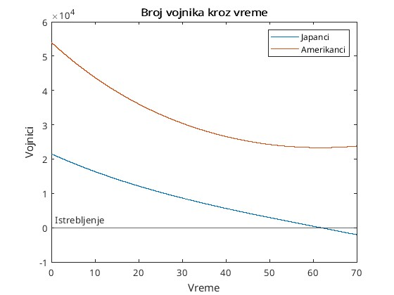
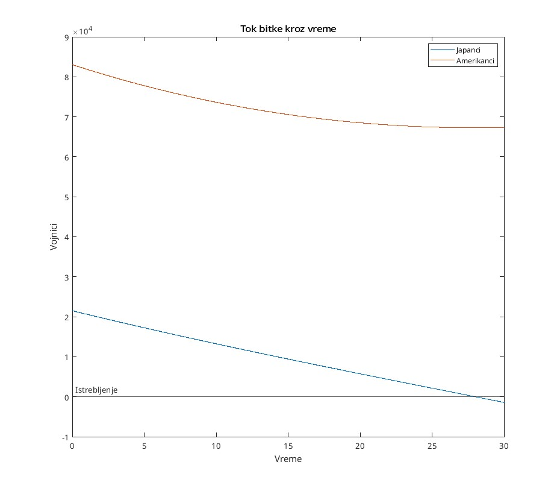
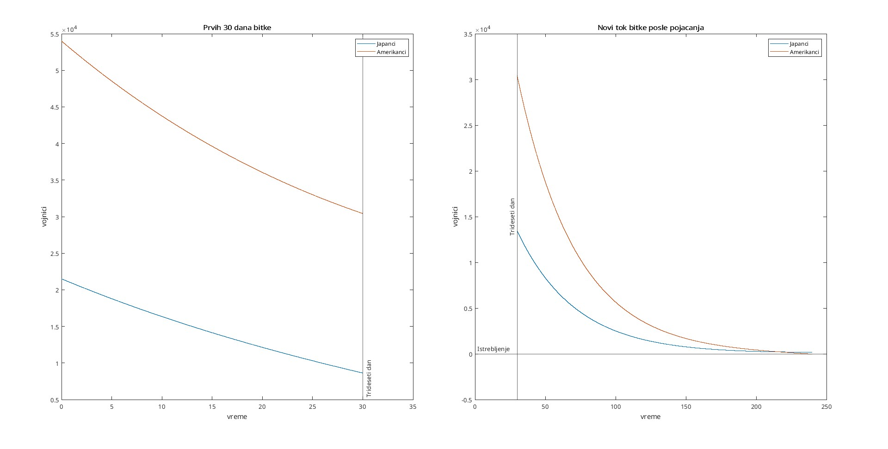

# Bitka za Ivo Džimu

Važna bitka u II svetskom ratu se odvijala na ostrvu Ivo Džima. Tamo je $21500$
japanskih vojnika dočekalo iskrcavanje $54000$ Amerikanaca. Razviti matematički
model bitke baziran na sistemu diferencijalnih jednačina. Stope efikasnosti dve
vojske su procenjene na $\lambda_A = 0.0106$ i $\lambda_J = 0.0544$ po danu borbe za američku i
japansku vojsku, respektivno.

* Koliko je dugo trajala bitka do istrebljenja jednog od učesnika? Koliko je
  preostalo vojnika na pobedničkoj strani?
  * 
* Posle 30 dana, koliko pojačanje bi trebalo da stigne Japancima da ne bi
  izgubili bitku?
  * 
* Ukoliko je potrebno da se pobeda ostvari za 28 dana, koliko vojnika je
  neophodno da Amerikanci imaju u početku?
  * 
